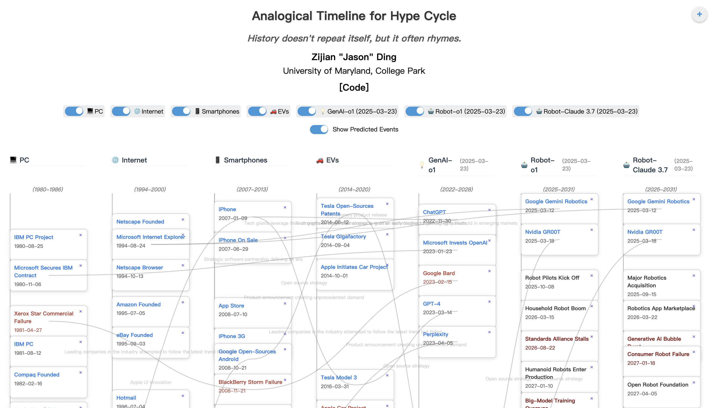

# Analogical Timeline for Hype Cycle

[Website](https://anatime.netlify.app/)

"History doesn't repeat itself, but it often rhymes."

Forecasting technological advancements has always been challenging. Yet, historical parallels can offer valuable insights into the patterns of innovation and adoption. We introduce the concept of an analogical timeline—a method of using the milestones and growth trajectory of one technology (e.g., Generative AI from 2022 to 2025) to predict the future evolution of another (e.g., robotics from 2025 onward). By examining how previous technology underwent phases of fundamental breakthroughs, mass adoption, and open-source strategy, we propose a structured framework for forecasting future technology advancement such as robotics. 

## Interface



## Getting Started

1. **Clone the Repository**  
   ```bash
   git clone https://github.com/your-username/analogical-timeline-hype-cycle.git
   cd analogical-timeline-hype-cycle
   ```

2. **Install Dependencies**  
   Make sure you have Node.js (version 14+) and npm (or Yarn) installed. Then run:
   ```bash
   npm install
   ```
   or
   ```bash
   yarn
   ```

3. **Start the Development Server**  
   ```bash
   npm start
   ```
   or
   ```bash
   yarn start
   ```
   This will open a local development server (usually at [http://localhost:3000](http://localhost:3000)).

4. **Build for Production**  
   ```bash
   npm run build
   ```
   or
   ```bash
   yarn build
   ```
   This creates a production-ready build in the `build` directory.

Contributions are welcome! Feel free to open an issue or submit a pull request if you have ideas for improvements or bug fixes.

1. Fork the repo and create your branch from `main`.  
2. Make your changes.  
3. Ensure lint checks and tests (if available) pass.  
4. Submit a pull request explaining your changes.

## Related Paper

[Fluid Transformers and Creative Analogies: Exploring Large Language Models’ Capacity for Augmenting Cross-Domain Analogical Creativity*](https://dl.acm.org/doi/abs/10.1145/3591196.3593516)

By Zijian Ding, Arvind Srinivasan, Stephen MacNeil, and Joel Chan  

**Citation**  
```
@inproceedings{ding2023fluid,
  title={Fluid transformers and creative analogies: Exploring large language models’ capacity for augmenting cross-domain analogical creativity},
  author={Ding, Zijian and Srinivasan, Arvind and MacNeil, Stephen and Chan, Joel},
  booktitle={Proceedings of the 15th Conference on Creativity and Cognition},
  pages={489--505},
  year={2023}
}
```