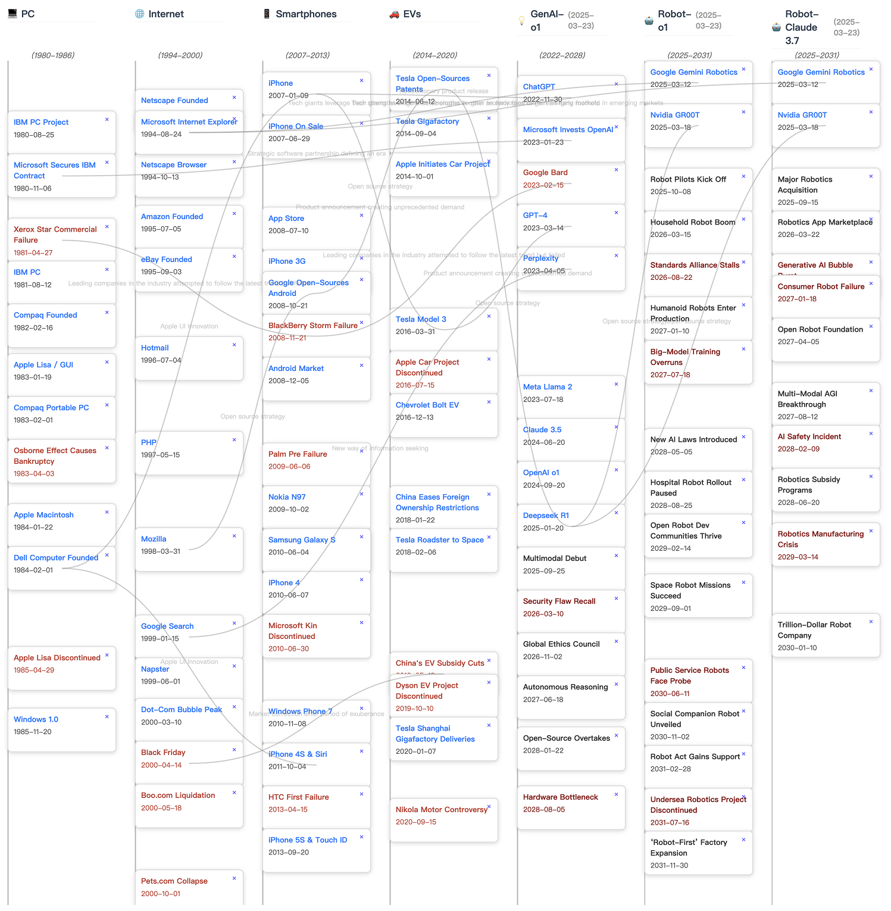
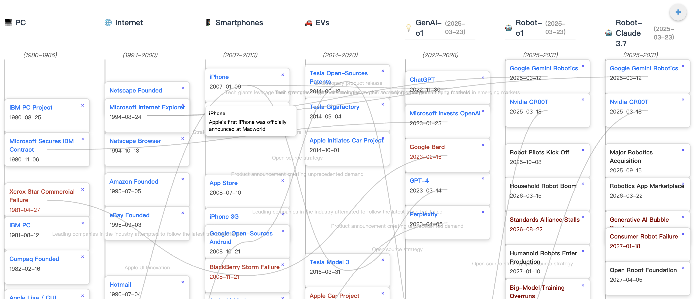
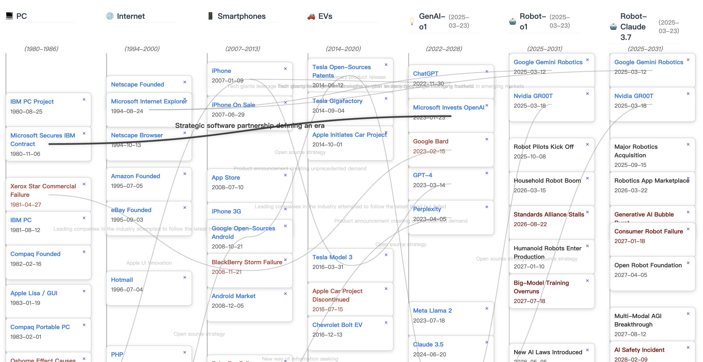
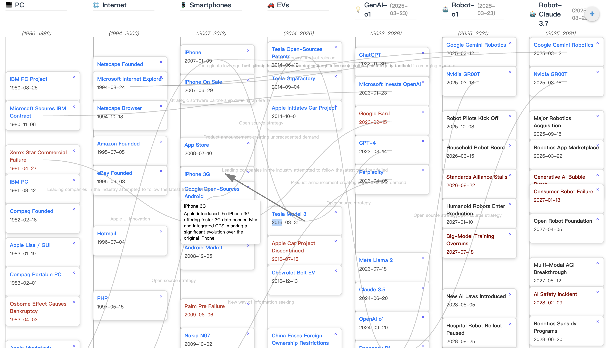
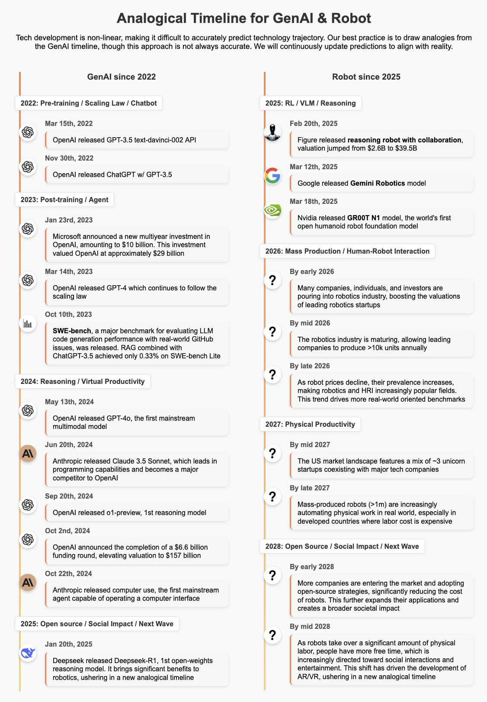

# Analogical Timeline for Hype Cycle

, University of Maryland, College Park

"History doesn't repeat itself, but it often rhymes."

We attempt to provide a preliminary direction for addressing a question that everyone is interested in but finds difficult to answer: What will the future be like?

Forecasting technological advancements has always been challenging. Yet, historical parallels can offer valuable insights into the patterns of innovation and adoption. We introduce the concept of an analogical timeline—a method of using LLM and milestones and growth trajectory of one technology (e.g., Generative AI from 2022 to 2025) to predict the future evolution of another (e.g., robotics from 2025 onward). By examining how previous technology underwent phases such as fundamental breakthroughs, mass adoption, and open-source strategy, we propose a structured framework for forecasting future technology advancement with GenAI.

You might ask, why not use time series? Yes, time series is a common method for event prediction, but LLMs are not trained based on time series data. Instead, they are trained on vast amounts of human data such as historical events. Using time series alone cannot fully leverage the generative capabilities of LLMs. Therefore, we propose the analogical timeline as a promising solution. We will keep upading our method.

## Interface

Check the interactive interface [here](https://anatime.netlify.app/). On this interface, you can select which timeline(s) to display and choose whether to include LLM-predicted events. For example, GenAI-o1 (2025-03-23) indicates the GenAI timeline, with future events predicted using o1 as of March 23, 2025.



### Interaction

Hover over event cards to view detailed information.



Hover over links to explore the analogical connections between events.



To create a new analogical connection between two cards, double-click on one card and then double-click on another.



Click the "+" button on the top right corner to add a new event card to one timeline.

## Getting Started

1. **Clone the Repository**  
   ```bash
   git clone https://github.com/your-username/analogical-timeline-hype-cycle.git
   cd analogical-timeline-hype-cycle
   ```

2. **Install Dependencies**  
   Make sure you have Node.js (version 14+) and npm (or Yarn) installed. Then run:
   ```bash
   npm install
   ```
   or
   ```bash
   yarn
   ```

3. **Start the Development Server**  
   ```bash
   npm start
   ```
   or
   ```bash
   yarn start
   ```
   This will open a local development server (usually at [http://localhost:3000](http://localhost:3000)).

4. **Build for Production**  
   ```bash
   npm run build
   ```
   or
   ```bash
   yarn build
   ```
   This creates a production-ready build in the `build` directory.

Contributions are welcome! Feel free to open an issue or submit a pull request if you have ideas for improvements or bug fixes.

1. Fork the repo and create your branch from `main`.  
2. Make your changes.  
3. Ensure lint checks and tests (if available) pass.  
4. Submit a pull request explaining your changes.

## Application

[Robot in 2025 as GenAI in 2022](https://robot-genai.netlify.app/)



## Related Paper

[Fluid Transformers and Creative Analogies: Exploring Large Language Models’ Capacity for Augmenting Cross-Domain Analogical Creativity*](https://dl.acm.org/doi/abs/10.1145/3591196.3593516)

By Zijian Ding, Arvind Srinivasan, Stephen MacNeil, and Joel Chan  

**Citation**  
```
@inproceedings{ding2023fluid,
  title={Fluid transformers and creative analogies: Exploring large language models’ capacity for augmenting cross-domain analogical creativity},
  author={Ding, Zijian and Srinivasan, Arvind and MacNeil, Stephen and Chan, Joel},
  booktitle={Proceedings of the 15th Conference on Creativity and Cognition},
  pages={489--505},
  year={2023}
}
```
